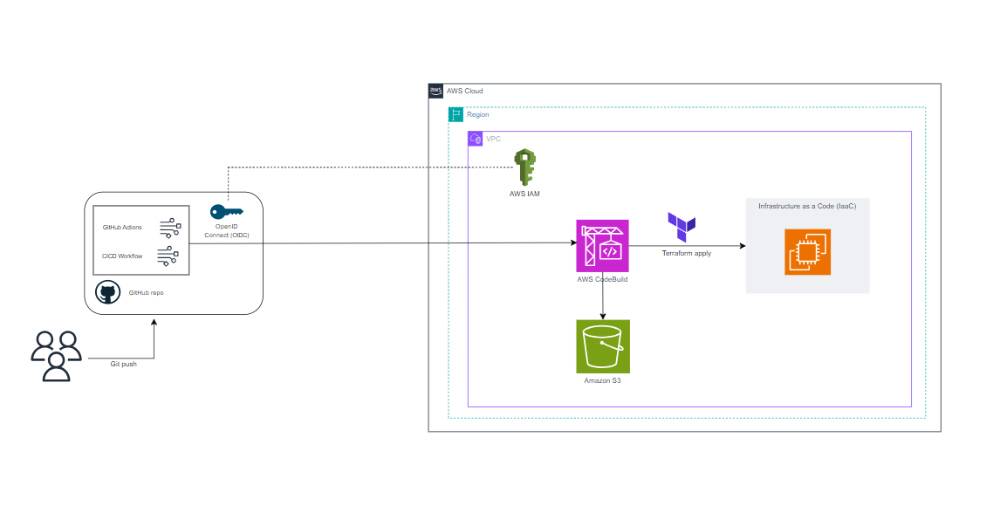

# CI/CD with Terraform

Authors: Marta Barriendos Fortuño (martabf@amazon.es), Borja Pérez Guasch (bpguasch@amazon.es)


## Introduction

This project shows a cloud architecture that implements a CI/CD pipeline capable of deploying Terraform code on AWS Graviton instances, using GitHub Actions to automatically make the deployment of the Terraform code to AWS. When a `git push` is made to the `main` branch, the pipeline runs and applies the changes to the infrastructure defined by Terraform in AWS. This architecture is a scalable mechanism that allows to deploy an infrastructure in a cost-effective manner. Moreover, thanks to the use of GitHub Actions, the process of setting up CI/CD pipelines is simplified. Starting from your GitHub repository, GitHub Actions enables seamless automation of workflows directly from the repository where the code resides. It facilitates and enhance your cloud deployment by using flexible workflows, which support a wide range of triggers and conditions. These workflows can be triggered by various events such as pushes, pull requests, etc. Additionally, there is a vast marketplace of reusable pre-built actions, which you can leverage to extend the capabilities of your workflows, saving time and effort in writing custom scripts for common tasks. 


## On this page

- [Understanding the CI/CD Pipeline](#understanding-the-cicd-pipeline)
- [Project Architecture](#project-architecture)
- [Requirements](#requirements)
- [Installation](#installation)
- [Update](#update)
- [Cleanup](#cleanup)
- [Using the Tool](#using-the-tool)
- [Security Considerations](#security-considerations)
- [Metrics](#metrics)

## Understanding the CI/CD Pipeline

The CI/CD pipeline is configured using GitHub Actions and consists of the following steps. First we define a workflow ([About workflows](https://docs.github.com/en/actions/using-workflows/about-workflows)) or configurable automated process, that will run a job. An event will trigger this workflow, specifically a push to the main branch, using the syntax of GitHub Actions ([Workflow syntax for GitHub Actions](https://docs.github.com/en/actions/using-workflows/workflow-syntax-for-github-actions#jobsjob_idruns-on)
). Finally, within the job, we define two steps that implement two actions developed by AWS for GitHub Actions.

1. **AWS Credentials Configuration**: Uses the [`aws-actions/configure-aws-credentials`](https://github.com/marketplace/actions/configure-aws-credentials-action-for-github-actions)
 action, that configures your AWS credentials and region environment variables to enable secure connectivity between your GitHub workflows and yor AWS account.
2. **CodeBuild Execution**: Uses the [`aws-actions/aws-codebuild-run-build`](https://github.com/aws-actions/aws-codebuild-run-build) action to build and run a CodeBuild project (that executes Terraform), collect the build logs and print them, specifying an inline buildspec definition with the required commands to deploy the Terraform project.

## Project Architecture



The project includes the following components:

- **GitHub Actions**: Manages the CI/CD workflow.
- **AWS CodeBuild**: Executes the Terraform commands to deploy the infrastructure.
- **Amazon S3**: Stores the Terraform state.
- **AWS IAM**: Manages the credentials and necessary permissions.

As can be seen in the presented architecture, we have a local repository hosting a Terraform code that defines the infrastructure we intend to deploy on AWS. When a change is made to this Terraform file and pushed, reflecting the change from the local repository to the remote repository, the defined workflow automatically initiates. It begins executing the job that has been defined, starting with the first step where we use the GitHub action `aws-actions/configure-aws-credentials` to configure AWS credentials. Subsequently, the second step deploys the CodeBuild project running on a Graviton instance `aws-actions/aws-codebuild-run-build`. During this step, Terraform is installed and configured. After successful setup, Terraform is initialized (`terraform init`), storing its state in the configured S3 bucket, followed by the deployment of the Terraform code with `terraform apply`. 

Each time a new change is made in the main branch (`git push`), CodeBuild verifies if the Terraform state stored in the S3 bucket matches the current state. If they match, no changes are made. Otherwise, the new Terraform state is stored in the bucket (replacing the old one), and the updated infrastructure is deployed anew.

## Requirements

In order to develop the architecture the following requirements are mandatory:
- **Repository in your GitHub account**
- **GitHub Actions Configuration**: Enable the option `Allow all actions and reusable workflows`in your settings repository, to be able to use actions created by AWS ([More information about managing GitHub Actions settings](https://docs.github.com/en/repositories/managing-your-repositorys-settings-and-features/enabling-features-for-your-repository/managing-github-actions-settings-for-a-repository))
-  **AWS Account**: ([For more information about creating an AWS Account](https://repost.aws/es/knowledge-center/create-and-activate-aws-account))
-  **Terraform code to deploy (IaaC)**: This will be the code tht will undergo changes.
## Installation

### 1. Clone the Repository

Create an empty repository (test-project) in your personal GitHub account, see [Create a repo](https://docs.github.com/en/repositories/creating-and-managing-repositories/quickstart-for-repositories). Clone it locally to your computer. You can ignore the warning about cloning an empty repository.

```
git clone [https://github.com/yourusername/your-repo.git (https://github.com/martabarriendosf/test-project.git)
```

Once you have the repository, it is important to configure Code Defender (PREGUNTAR BORJA) to allow pushing code to a public repository.

```
git defender --setup
```
Finally, make sure your remote repository points to your personal GitHub repository using the following commands.

```
git remote remove origin
```

```
git remote add origin <your repository url>
```

```
git branch -M main
```

```
git push -u origin main
```

### 2. Set up the Repository 
In this step, we can now work in the local GitHub repository to create the project. From this point forward, it is advisable to use a code editor tool such as [Visual Studio Code](https://code.visualstudio.com/) . Within the repository itself, the first task is to generate the main Terraform file (main.tf) which will contain the IaaC to be deployed to AWS. Secondly, create a folder with the path .github\workflows where the YAML file will be housed to configure the workflow with the necessary GitHub Actions.

### 3. AWS Architecture and Connection to the GitHub repository
In this section, we will use the AWS console with which we must make 3 steps to achieve the desired configuration:
- **1. Create an IAM user**: [Info about creating a new IAM user](https://docs.aws.amazon.com/IAM/latest/UserGuide/id_users_create.html)
- **2. Create a S3 bucket**: [Info about creating a new S3 bucket]( https://docs.aws.amazon.com/AmazonS3/latest/userguide/creating-bucket.html)
- **3. Create a CodeBuild project**: [Info about creating a new CodeBuild project](https://docs.aws.amazon.com/codebuild/latest/userguide/create-project-console.html)

The first step is to create an IAM user with programmatic access, so that this user has an access key and access key ID, which we will use with the first GitHub action (`aws-actions/configure-aws-credentials`) to configure the credentials and access to the AWS environment. Additionally, these credentials must be saved as GitHub secrets. Once the IAM user is created, appropriate permissions need to be assigned since it does not have any by default. This is done using IAM policies. Specifically, we need to grant the IAM user Administrator access (`AdministratorAccess`), access to the S3 bucket (`AmazonS3FullAccess`), and for this project, access to the EC2 instance that Terraform will deploy (`AmazonEC2FullAccess`). 

Similarly, it will be necessary to create the S3 bucket where we will store the Terraform state. When creating the bucket, ensure to enable `Bucket versioning` to be able to preserve, retrieve, and restore every version of every object stored in your Amazon S3 bucket. Moreover, the name of the S3 bucket will also be saved as a GitHub Secret, to configure the backend for saving the Terrafom state file.

Lastly, it is necessary to create a CodeBuild project. Since the buildspec.yml file will be provided from GitHub, no specific configuration is required through the AWS console. Simply associate the project with the same name that will be assigned in the buildspec for the GitHub action (`aws-actions/aws-codebuild-run-build`) to deploy it properly. Additionally, a default role will be created for this project, so it is important to assign this IAM role permissions for accessing the S3 bucket (as CodeBuild needs to access the Terraform state in that bucket), `AmazonS3FullAccess`, and permissions to deploy the EC2 instance (`AmazonEC2FullAccess`). On the other hand, while configuring the CodeBuild project, GitHub must be specified as Primary Source. Therefore, to stablish the connection between CodeBuild and the GitHub source repository OAuth must be used, to specify the GitHub repository Path in the project.


### 4. Worflow configuration

Finally, we just need to implement the file YAML that will contain the workflow configuration, that as it has been explained before, will be located in the path `.\github\workflows.`
The desired idea is to configure the workflow to run when a push is made to the default branch of your repository. Based on the [GitHub Actions workflows documentation](https://docs.github.com/en/actions/using-workflows/triggering-a-workflow), Workflow triggers are defined with the  `on` key, for more information, see ([Workflow syntax for GitHub Actions](https://docs.github.com/en/actions/using-workflows/workflow-syntax-for-github-actions#jobsjob_idruns-on). To trigger a workflow run, the following steps occur:

- **1)**: An event occurs in your repository, this event will have associated a specific `GITHUB_SHA`(commit SHA) and `GIHUB_REF` (Git ref).

- **2)**: GitHub then searches the `.github/workflows` directory at the repository root for workflow files corresponding to the commit SHA or Git ref associated with the event (this explains the relevance of configuring the workflow files in the proper path).

- **3)**: A workflow run is triggered for any workflows with on: values matching the triggering event. When a workflow runs, GitHub sets the `GITHUB_SHA` (commit SHA) and  `GITHUB_REF` (Git ref) environment variables in the runner environment. The `GITHUB_SHA` will be used later to clone the repository in the AWS Virtual Machine. For more details, see [Variables in GitHub Actions](https://docs.github.com/en/actions/learn-github-actions/variables)

In order to implement this first part, we start giving the workflow a name, that will appear in the "Actions" tab of the GitHub repository:
```
name: CI/CD with Terraform
```

Now we have to specify the trigger for this workflow, in this case the push event in the main branch, so a workflow run is triggered every time someone pushes a change to the repository:

```
on:
  push:
    branches:
      - main
```
The next step is to group together all the jobs that run in the `CI/CD with Terraform` workflow, in this case there's only one job identified by the key `terraform`. Inside this job, three sections must be defined. 
- **1) runs-on**: This first section configures the virtual machine hosted by GitHub where the `terraform` job will be executed, as will be seen in the code, in this case is configured to run on the latest version of an Ubuntu Linux runner.
- **2) env**: By using the key `env`, you can set custom environment variables for the workflow. Since it is defined at the top level of the worflow, the scope of these `env` variables will be the entire workflow. As it is shown in the next code, there are 4 environment variables,  `AWS_ACCESS_KEY_ID`,  `AWS_SECRET_ACCESS_KEY`,  `AWS_DEFAULT_REGION` and  `AWS_S3_BUCKET`, that in the third section have been saved as GitHub secrets.
- **3) steps**: This last section groups together all the steps that run in the `terraform` job. Each item inside this section is a separate action or shell script. To be exact, this section will have the two items or steps corresponding to the two GitHub actions that will be used, and that has been mentioned before, [`aws-actions/configure-aws-credentials`](https://github.com/marketplace/actions/configure-aws-credentials-action-for-github-actions) and [`aws-actions/aws-codebuild-run-build`](https://github.com/aws-actions/aws-codebuild-run-build).

```
jobs:
  terraform:
    runs-on: ubuntu-latest

    env:
      AWS_ACCESS_KEY_ID: ${{ secrets.AWS_ACCESS_KEY_ID }}
      AWS_SECRET_ACCESS_KEY: ${{ secrets.AWS_SECRET_ACCESS_KEY }}
      AWS_DEFAULT_REGION: ${{ secrets.AWS_DEFAULT_REGION }}
      AWS_S3_BUCKET: ${{ secrets.AWS_S3_BUCKET }}

    
    steps:

```

Below is the first step of the workflow job, which consists of configuring the AWS credentials. This GitHub action ([`aws-actions/configure-aws-credentials`](https://github.com/marketplace/actions/configure-aws-credentials-action-for-github-actions)) implements the AWS JavaScript SDK credential resolution chain and exports session environment variables for your other Actions to use. Additionally, the recommended method for fetching credentials from AWS has been used, which consists of using GitHub's OIDC provider in conjunction with a configured AWS IAM Identity Provider endpoint. Furthermore, following AWS security recommendations for IAM users, the principle of least privilege has been applied: Grant only the permissions required to perform the actions in your GitHub Actions workflows.

```
 - name: Configure AWS Credentials
        uses: aws-actions/configure-aws-credentials@v1
        with:
          aws-access-key-id: ${{ secrets.AWS_ACCESS_KEY_ID }}
          aws-secret-access-key: ${{ secrets.AWS_SECRET_ACCESS_KEY }}
          aws-region: ${{ secrets.AWS_DEFAULT_REGION }}
```
Finally, the last job of the workflow named `Run CodeBuild` is presented in the next code, which consists of deploying the CodeBuild project using the GitHub action [`aws-actions/aws-codebuild-run-build`](https://github.com/aws-actions/aws-codebuild-run-build). It's important to remark that as it has been explained before, the name of the codeBuild project  `project-name: my-codebuild-job2` must be the same that has been given to it before in the AWS Console. On the other hand, using the command `project-name:  buildspec-override` we make sure to override the buildspec file that has been configured by default in the CodeBuild project with the AWS console with the the following inline buildspec. Diving deeper into the inline buildspec, it is clear that has two main phases. 

The `install` phase, is design to set up the project's execution environment installing the necessary utilities, configuring additional resources, and instaling Terraform along with verifying its version, to ensure the environment is properly configured before proceeding with subsequent phases of the build and deployment process. Looking at every detail, `git fetch --depth=1` searches the latest commit from the Git repositoy with a history depth limited to 1, optimizing dowload time and disk space, `git checkout --force ${{ github.sha }}` checks out the specific commit that triggered the workflow on GitHub (which would be a push in the main repsository) using the environment variable  github.sha that contains the SHA of the commit that triggered the workflow (as it has been explained before) and clonning the repository in the AWS Virtual Machine (The Amazon Linux Machine that has been chosen when configuring the CodeBuild project), `git lfs pull` this command pulls down large files that are tracked by Git LFS, so if the repository uses Git LFS (Large File Storage),it ensures all necessary large files for the build are available. Once the repository is available in the AWS Virtual Machine, the rest of the commands are necessary to install terraform, `sudo yum install -y yum-utils` installs yum-utils, which is a collection of utilities for managing software packages and are needed to install terraform, `sudo yum-config-manager --add-repo https://rpm.releases.hashicorp.com/AmazonLinux/hashicorp.repo` adds the HashiCorp repository to the configured yum repositories. This allows yum to search for and download packages provided by HashiCorp from this repository to being able to install Terraform. Finally, `sudo yum -y install terraform` installs Terraform using yum. The -y flag automatically accepts any installation prompts, and with the command `terraform --version` checks the installed version of Terraform on the system. 

The `build` phase has two steps. The first one runs `terraform init` that initializes Terraform for the project. Initialization is necessary to set up the environment, download providers, and prepare the backend for state storage. Additionally, with the `init` command the next options are configured `terraform init -backend-config="bucket=${{ env.AWS_S3_BUCKET }}" -backend-config="key=terraform.tfstate" -backend-config="region=${{ env.AWS_DEFAULT_REGION }}" ` , thanks to these options, it is specified the S3 bucket and file (terraform.tfstate) where Terraform will store its state files, using again enviroment variables. The second step runs the command `terraform apply -auto-approve` that applies the Terraform configuration to create or update (depending of the state file of the S3 bucket) the infrastructure as defined in the Terraform files (*.tf). In this step is important to remark the `auto-approve` part, which is essential to automatically approve and appliy changes without prompting for confirmation. since this is the implementation of a CI/CD pipeline where manual intervention is not desired.

To sum up, Terraform reads the configuration files (*.tf) and compares the desired state (defined in these files) with the current state of the infrastructure (saved in the S3 bucket in the terraform.tfstate file). It determines what changes are needed to achieve the desired state (creation, modification, or deletion of resources). If changes are required, Terraform makes API calls to the corresponding cloud provider (in this case, AWS) to provision or modify resources. Once completed, Terraform updates the state file (terraform.tfstate) with the current state of the infrastructure.

There is a third phase called `artifacts` and defines that when the `build` phase succesfully completes, AWS will collect all files and directories and package them as artifacts, which could be used in subsequent seteps of the CI/CD workflow, such as deploying the application to a production environment.

```
  - name: Run CodeBuild
        uses: aws-actions/aws-codebuild-run-build@v1
        with:
          project-name: my-codebuild-job2
          disable-source-override: true
          buildspec-override: |
            version: 0.2
            phases:
              install:
                commands:
                  - git fetch --depth=1
                  - git checkout --force ${{ github.sha }}
                  - git lfs pull
                  - sudo yum install -y yum-utils
                  - sudo yum-config-manager --add-repo https://rpm.releases.hashicorp.com/AmazonLinux/hashicorp.repo
                  - sudo yum -y install terraform
                  - terraform --version

              pre_build:
                commands:
                  - echo "Pre-build phase"
              build:
                commands:
                  - terraform init -backend-config="bucket=${{ env.AWS_S3_BUCKET }}" -backend-config="key=terraform.tfstate" -backend-config="region=${{ env.AWS_DEFAULT_REGION }}"
                  - terraform apply -auto-approve

              post_build:
                commands:
                  - echo "Post-build phase"

            artifacts:
              files:
                - '**/*'
```


In summary, the build phase executes two main commands related to Terraform:

Initialization (terraform init): Sets up Terraform environment, configures backend settings (S3 bucket for state storage), and prepares for managing infrastructure.

Deployment (terraform apply): Applies the defined Terraform configuration to create or modify infrastructure in AWS based on the configuration files (*.tf), using the settings provided during initialization.

These commands are crucial for managing infrastructure as code (IaC) with Terraform, ensuring consistent and reproducible deployments of AWS resources according to defined configurations.


### 5. Terraform file configuration

ESPECIFICAR LO DEL BUCKET S3 QUE SE DEFINE EN EL MAIN.TF


