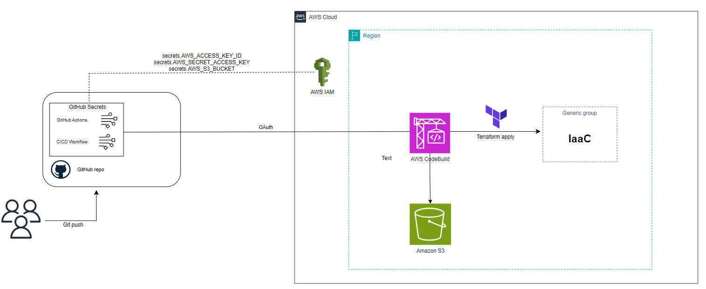

# CI/CD with Terraform

Authors: Marta Barriendos Fortuño (martabf@amazon.es), Borja Pérez Guasch (bpguasch@amazon.es)


## Introduction

This project shows a cloud architecture that implements a CI/CD pipeline capable of deploying Terraform code on AWS Graviton instances, using GitHub Actions to automatically make the deployment of the Terraform code to AWS. When a `git push` is made to the `main` branch, the pipeline runs and applies the changes to the infrastructure defined by Terraform in AWS. This architecture is a scalable mechanism that allows to deploy an infrastructure in a cost-effective manner. Moreover, thanks to the use of GitHub Actions, the process of setting up CI/CD pipelines is simplified. Starting from your GitHub repository, GitHub Actions enables seamless automation of workflows directly from the repository where the code resides. It facilitates and enhance your cloud deployment by using flexible workflows, which support a wide range of triggers and conditions. These workflows can be triggered by various events such as pushes, pull requests, etc. Additionally, there is a vast marketplace of reusable pre-built actions, which you can leverage to extend the capabilities of your workflows, saving time and effort in writing custom scripts for common tasks. 


## On this page

- [Understanding the CI/CD Pipeline](#understanding-the-cicd-pipeline)
- [Project Architecture](#project-architecture)
- [Requirements](#requirements)
- [Installation](#installation)
- [Update](#update)
- [Cleanup](#cleanup)

## Understanding the CI/CD Pipeline

The CI/CD pipeline is configured using GitHub Actions and consists of the following steps. First we define a workflow ([About workflows](https://docs.github.com/en/actions/using-workflows/about-workflows)) or configurable automated process, that will run a job. An event will trigger this workflow, specifically a push to the main branch, using the syntax of GitHub Actions ([Workflow syntax for GitHub Actions](https://docs.github.com/en/actions/using-workflows/workflow-syntax-for-github-actions#jobsjob_idruns-on)
). Finally, within the job, we define two steps that implement two actions developed by AWS for GitHub Actions.

1. **AWS Credentials Configuration**: Uses the [`aws-actions/configure-aws-credentials`](https://github.com/marketplace/actions/configure-aws-credentials-action-for-github-actions)
 action, that configures your AWS credentials and region environment variables to enable secure connectivity between your GitHub workflows and yor AWS account.
2. **CodeBuild Execution**: Uses the [`aws-actions/aws-codebuild-run-build`](https://github.com/aws-actions/aws-codebuild-run-build) action to build and run a CodeBuild project (that executes Terraform), collect the build logs and print them, specifying an inline buildspec definition with the required commands to deploy the Terraform project.

## Project Architecture



The project includes the following components:

- **GitHub Actions**: Manages the CI/CD workflow.
- **AWS CodeBuild**: Executes the Terraform commands to deploy the infrastructure.
- **Amazon S3**: Stores the Terraform state.
- **AWS IAM**: Manages the credentials and necessary permissions.

As can be seen in the presented architecture, we have a local repository hosting a Terraform code that defines the infrastructure we intend to deploy on AWS. When a change is made to this Terraform file and pushed, reflecting the change from the local repository to the remote repository, the defined workflow automatically initiates. It begins executing the job that has been defined, starting with the first step where we use the GitHub action `aws-actions/configure-aws-credentials` to configure AWS credentials. Subsequently, the second step deploys the CodeBuild project running on a Graviton instance `aws-actions/aws-codebuild-run-build`. During this step, Terraform is installed and configured. After successful setup, Terraform is initialized (`terraform init`), storing its state in the configured S3 bucket, followed by the deployment of the Terraform code with `terraform apply`. 

Each time a new change is made in the main branch (`git push`), CodeBuild verifies if the Terraform state stored in the S3 bucket matches the current state. If they match, no changes are made. Otherwise, the new Terraform state is stored in the bucket (replacing the old one), and the updated infrastructure is deployed anew.

## Requirements

In order to develop the architecture the following requirements are mandatory:
- **Repository in your GitHub account**
- **GitHub Actions Configuration**: Enable the option `Allow all actions and reusable workflows`in your settings repository, to be able to use actions created by AWS ([More information about managing GitHub Actions settings](https://docs.github.com/en/repositories/managing-your-repositorys-settings-and-features/enabling-features-for-your-repository/managing-github-actions-settings-for-a-repository))
-  **AWS Account**: ([For more information about creating an AWS Account](https://repost.aws/es/knowledge-center/create-and-activate-aws-account))
-  **Terraform code to deploy (IaaC)**: This will be the code that will undergo changes.
-  **CI/CD Pipeline deploy with a Terraform File as IaaC**: This will be the resources needed for the CI/CD pipeline.
-  
## Installation

### 1. Set up the GitHub repository

Create an empty repository (test-project) in your personal GitHub account, see [Create a repo](https://docs.github.com/en/repositories/creating-and-managing-repositories/quickstart-for-repositories). Clone it locally to your computer. You can ignore the warning about cloning an empty repository.

```
git clone https://github.com/yourusername/your-repo.git
```

Once you have the repository, it is important to configure Code Defender (PREGUNTAR BORJA SI ESTO ES SOLO EN AWS) to allow pushing code to a public repository.

```
git defender --setup
```
Finally, make sure your remote repository points to your personal GitHub repository using the following commands.

```
git remote remove origin
```

```
git remote add origin <your repository url>
```

```
git branch -M main
```

```
git push -u origin main
```


### 2. Deploy the CI/CD pipeline
In this section, we will use a Terrraform file (IaaC) to create the resources needed to create the CI/CD pipeline, we will need 3 main resources to achieve the desired configuration:
- **1. Create an IAM user**: [Info about creating a new IAM user](https://docs.aws.amazon.com/IAM/latest/UserGuide/id_users_create.html)
- **2. Create a S3 bucket**: [Info about creating a new S3 bucket]( https://docs.aws.amazon.com/AmazonS3/latest/userguide/creating-bucket.html)
- **3. Create a CodeBuild project**: [Info about creating a new CodeBuild project](https://docs.aws.amazon.com/codebuild/latest/userguide/create-project-console.html)

The first step is to create an IAM user with programmatic access, so that this user has an access key and access key ID, which we will use with the first GitHub action (`aws-actions/configure-aws-credentials`) to configure the credentials and access to the AWS environment. Additionally, these credentials must be saved as GitHub secrets. Once the IAM user is created, appropriate permissions need to be assigned since it does not have any by default. This is done using IAM policies. Specifically, we need to grant the IAM user access to launch the CodeBuild project (`CodeBuildAdminAccess`).

Similarly, it will be necessary to create the S3 bucket where we will store the Terraform state. When creating the bucket, it's important to enable `Bucket versioning` to be able to preserve, retrieve, and restore every version of every object stored in your Amazon S3 bucket. Moreover, the name of the S3 bucket will also be saved as a GitHub Secret, to configure the backend for saving the Terrafom state file.

Lastly, it is necessary to create a CodeBuild project. Since the buildspec.yml file will be provided from GitHub, no specific configuration is required through the AWS console. Simply associate the project with the same name that will be assigned in the buildspec for the GitHub action (`aws-actions/aws-codebuild-run-build`) to deploy it properly, since this GitHub actions requires for the CodeBuild project to exist to be able to launch it. Additionally, it is important to assign to the IAM role for CodeBuild permissions for accessing the S3 bucket (as CodeBuild needs to access the Terraform state in that bucket), `AmazonS3FullAccess`, and permissions to deploy the EC2 instance (`AmazonEC2FullAccess`) of the Terraform file. On the other hand, while configuring the CodeBuild project, GitHub must be specified as Primary Source. Therefore, to stablish the connection between CodeBuild and the GitHub source repository OAuth must be used, to specify the GitHub repository Path in the project.

All these things are provided by default in the CI/CD Terraform file, therefore, when you run the commands `terraform plan` and `terraform apply` you will be asked to enter a value for the S3 name (remember it must be a unique value) and to enter the value of the URL of your GitHub repository. No further changes are necessary, the default values used in this configuration are, the default region (`us-east-1`) and the name of the CodeBuild project (`my-codebuild-job-terraform`).


### 3. Create your project
In this step, we already have the needed resources for the CI/CD pipeline, now we can now work in the local GitHub repository to create the project. From this point forward, it is advisable to use a code editor tool such as [Visual Studio Code](https://code.visualstudio.com/) . Within the repository itself, the first task is to generate the main Terraform file (main.tf) which will contain the IaaC to be deployed to AWS. Secondly, create a folder with the path .github\workflows where the YAML file will be housed to configure the workflow with the necessary GitHub Actions. Therefore, in this path, you will have to introduce the YAML file (buildspec.yml) provided in this documentation. 

#### 3.1 Customize your YAML file
This file makes use of 3 variables, saved as GitHub secrets, the access keys of the IAM user and the name of the S3 bucket. You should take in mind that the CodeBuild project name in this file must be the same than in the CI/CD configuration file, so if you changed it in the previous step you must be consistent. The first step in this section is to acces to the AWS Console, exactly to the IAM user you have created (by default is `codebuild-admin-user`), click on `Security Credentials` and `Create access keys`, a .csv file will be downloaded in your computer with the `secret access key` and the `secret access key id`. Now you already have everything to save the secrets in GitHub, to do this you should go to your GitHub repository in your GitHub account, access to `Settings`, `Secrets and variables`, `Actions` and `New repository secret`, here you should create the four necessary secrets, and give them the proper name used in the YAML file, `AWS_ACCESS_KEY_ID` (IAM user secret access key id), `AWS_SECRET_ACCESS_KEY `(IAM user secret access key) and `AWS_S3_BUCKET `(name of the S3 bucket you entered in the CI/CD Terraform file).

### 4. Worflow configuration details (no changes needed)

Finally, it is worth noting that the YAML file will contain the workflow configuration, that as it has been explained before, will be located in the path `.\github\workflows.`
The desired idea is to configure the workflow to run when a push is made to the default branch of your repository. Based on the [GitHub Actions workflows documentation](https://docs.github.com/en/actions/using-workflows/triggering-a-workflow), Workflow triggers are defined with the  `on` key, for more information, see ([Workflow syntax for GitHub Actions](https://docs.github.com/en/actions/using-workflows/workflow-syntax-for-github-actions#jobsjob_idruns-on). To trigger a workflow run, the following steps occur:

- **1)**: An event occurs in your repository, this event will have associated a specific `GITHUB_SHA`(commit SHA) and `GIHUB_REF` (Git ref).

- **2)**: GitHub then searches the `.github/workflows` directory at the repository root for workflow files corresponding to the commit SHA or Git ref associated with the event (this explains the relevance of configuring the workflow files in the proper path).

- **3)**: A workflow run is triggered for any workflows with on: values matching the triggering event. When a workflow runs, GitHub sets the `GITHUB_SHA` (commit SHA) and  `GITHUB_REF` (Git ref) environment variables in the runner environment. The `GITHUB_SHA` will be used later to clone the repository in the AWS Virtual Machine. For more details, see [Variables in GitHub Actions](https://docs.github.com/en/actions/learn-github-actions/variables)

The first step of the workflow job, consists of configuring the AWS credentials. This GitHub action ([`aws-actions/configure-aws-credentials`](https://github.com/marketplace/actions/configure-aws-credentials-action-for-github-actions)) implements the AWS JavaScript SDK credential resolution chain and exports session environment variables for your other Actions to use. 

Finally, the last step of the workflow named `Run CodeBuild` consists of deploying the CodeBuild project using the GitHub action [`aws-actions/aws-codebuild-run-build`](https://github.com/aws-actions/aws-codebuild-run-build). It's important to remark that as it has been explained before, the name of the codeBuild project  `project-name: my-codebuild-job-terraform` must be the same that has been given to it before in the AWS Console. This step has two phases:
- The `install` phase, is design to set up the project's execution environment installing the necessary utilities, configuring additional resources, and instaling Terraform along with verifying its version, to ensure the environment is properly configured before proceeding with subsequent phases of the build and deployment process.

- The `build` phase, has two steps. The first one runs `terraform init` that initializes Terraform for the project. The second step runs the command `terraform apply -auto-approve` that applies the Terraform configuration to create or update (depending of the state file of the S3 bucket) the infrastructure as defined in the Terraform files (*.tf). In this step is important to remark the `auto-approve` part, which is essential to automatically approve and appliy changes without prompting for confirmation. since this is the implementation of a CI/CD pipeline where manual intervention is not desired.

To sum up, Terraform reads the configuration files (*.tf) and compares the desired state (defined in these files) with the current state of the infrastructure (saved in the S3 bucket in the terraform.tfstate file). It determines what changes are needed to achieve the desired state (creation, modification, or deletion of resources). If changes are required, Terraform makes API calls to the corresponding cloud provider (in this case, AWS) to provision or modify resources. Once completed, Terraform updates the state file (terraform.tfstate) with the current state of the infrastructure.

These commands are crucial for managing infrastructure as code (IaC) with Terraform, ensuring consistent and reproducible deployments of AWS resources according to defined configurations.


### 5. Terraform file configuration

At this step, we have everything ready to deploy our Terraform code on AWS. However, before doing this, it is necessary to specify within your Terraform file that you want to deploy, the configuration of the S3 bucket that you will use to store the Terraform state, and whose name you already specified earlier in the Terraform CI/CD Pipeline configuration file. You should include the next code lines:

```
# store the terraform state file in s3
terraform {
  backend "s3" {
    bucket  = <The unique name of your S3 bucket>
    key     = "terraform.tfstate" #Name we want to give to the state file in the bucket
    region  = "us-east-1"

  }
}
```

## Update

Once you have everything prepared, you can push your changes to GitHub, and they will be automatically deployed to AWS, if you are using a Code Editor like `Visual Studio Code`, just use the button `Commit and Sync`.
If you are using Git bash:


```
git add .

git commit -m “Initial commit”

git push
```

## Clean up

1) Access to your project folder where you have the Terraform code that you want to deploy, go to the `.github\workflows path`, and change in the buildspec file the command `terraform apply -auto-approve ` by `terraform destroy -auto-approve`
2) Go to the AWS Console, navigate to the S3 section, access to your S3 bucket and delete the file `terraform.tfsate`.Then, navigate to the IAM user section and delete the access keys you created before.
3) Access to the second project where you deploy the CI/CD pipeline resources, navigate to the CLI terminal and run the command `terraform destroy`

